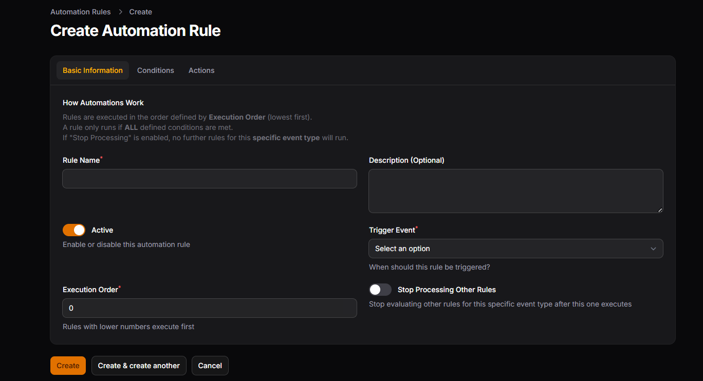

# Creators Ticketing for Filament v4

[](https://packagist.org/packages/daacreators/creators-ticketing)
[](https://packagist.org/packages/daacreators/creators-ticketing)
[](LICENSE.md)

A robust and dynamic ticketing system plugin for Filament 4, providing a complete helpdesk solution for your Laravel application.

## Screenshots


*Tickets List*


*Ticket View*


*Create Automation*


*Submit Ticket Form*


*User's Tickets List*


*User's Chat View*


*User's Chat View with Closed Status*

## Features

- Full ticketing system with departments and forms
- Agent management with department assignments
- Custom form builder for ticket submissions
- Real-time ticket chat using Livewire
- Ticket statistics dashboard widget
- Granular permission system
- Read/Unread status indicators for agents
- File attachments support
- Responsive design
- Multi-language support
- Event system for extensibility
- Automation based on events
- Seamless integration with Filament 4

## Requirements

- PHP 8.2 or higher
- Laravel 11.x|12.x
- Filament 4.1.7 or higher
- Livewire 3.x

## Installation

You can install the package via composer:
```bash
composer require daacreators/creators-ticketing
```

After installation, publish the config file:
```bash
php artisan vendor:publish --tag="creators-ticketing-config"
```

### Setup: Filament Panel Integration

The plugin integration code should be added to your main Filament admin panel provider file, which is typically located at:
```
app/Providers/Filament/AdminPanelProvider.php
```

Open your AdminPanelProvider.php file and modify the panel() method as shown below:
```php
use Filament\Panel;
use Filament\PanelProvider;
use daacreators\CreatorsTicketing\TicketingPlugin;

class AdminPanelProvider extends PanelProvider
{
    public function panel(Panel $panel): Panel
    {
        return $panel
            ->default()
            ->plugins([
                TicketingPlugin::make(),
            ]);
    }
}
```

Run the migrations:
```bash
php artisan migrate
```

### Seeding Ticket Statuses

After running migrations, you can seed default ticket statuses using the provided seeder:
```bash
php artisan db:seed --class=daacreators\\CreatorsTicketing\\Database\\Seeders\\TicketStatusSeeder
```

This will create the following default ticket statuses:
- **Open** (Blue) - Default status for new tickets
- **In Progress** (Amber) - Tickets being worked on
- **Answered** (Green) - Tickets that have been answered
- **Pending** (Purple) - Tickets waiting for response
- **Resolved** (Green) - Tickets that have been resolved
- **Closed** (Gray) - Closing status for completed tickets

The seeder uses `updateOrCreate` to prevent duplicates, so you can safely run it multiple times.

## Upgrading

### Upgrading from v1.1.4 to v1.1.5
**⚠️ Important:** Version v1.1.5 and introduces new fields to the database table. If you are upgrading from a previous version, you **must** run the migrations after updating the package to ensure the system functions correctly:
```bash
php artisan migrate
```

## Configuration

### Basic Configuration

Configure the package by setting values in your `.env` file or directly in the `config/creators-ticketing.php` file:
```php
TICKETING_NAV_GROUP="Creators Ticketing"

USER_MODEL="\App\Models\User"

TICKETING_NAV_FIELD=email
TICKETING_NAV_ALLOWED=admin@demo.com,manager@demo.com
```

### Navigation Visibility

You can control who sees the ticketing resources in the admin panel by configuring the navigation visibility rules:
```php
'navigation_visibility' => [
    'field' => 'email',
    'allowed' => ['admin@site.com', 'manager@site.com']
],
```

## Multi-language Support

This plugin is fully localized and supports multiple languages out of the box. It automatically detects and uses your application's current locale configuration (`config/app.php`).

**Currently supported languages:**

- 🇺🇸 **English** (`en`) - Default
- 🇪🇸 **Spanish** (`es`)
- 🇧🇷 **Portuguese (Brazil)** (`pt_BR`)
- 🇫🇷 **French** (`fr`)
- 🇩🇪 **German** (`de`)
- 🇸🇦 **Arabic** (`ar`)
- 🇨🇳 **Chinese (Simplified)** (`zh_CN`)

### Publishing Translations

If you wish to modify the texts or add a new language, you can publish the translation files:
```bash
php artisan vendor:publish --tag="creators-ticketing-translations"
```

## Usage

### Creating Forms

1. Go to the Forms section in the admin panel
2. Create a new form with custom fields

### Setting Up Departments

1. Navigate to the Filament admin panel
2. Go to the Departments section
3. Create departments and assign agents
4. Assign the form to specific departments

### Managing Tickets

Tickets can be managed through the Filament admin panel. You can:
- View all tickets **(New updates are marked with a "NEW" badge)**
- Assign tickets to agents
- Change ticket status
- Add internal notes
- Communicate with users
- Track ticket activities

### Frontend Integration

To add the tickets and ticket submission form to your frontend:
```blade
@livewire('creators-ticketing::ticket-submit-form')
```

## Dashboard Widget

The package includes a ticket statistics widget. Add it to your Filament dashboard:
```php
use daacreators\CreatorsTicketing\Filament\Widgets\TicketStatsWidget;

class DashboardConfig extends Config
{
    public function widgets(): array
    {
        return [
            TicketStatsWidget::class,
        ];
    }
}
```

## Events System

The plugin dispatches events for major ticket actions, allowing you to extend functionality with custom listeners.

### Available Events

All events are located in the `daacreators\CreatorsTicketing\Events` namespace:

| Event | Triggered When | Properties |
|-------|---------------|------------|
| `TicketCreated` | A new ticket is created | `Ticket $ticket`, `?User $user` |
| `TicketAssigned` | Ticket is assigned/reassigned | `Ticket $ticket`, `?int $oldAssigneeId`, `?int $newAssigneeId`, `?User $assignedBy` |
| `TicketStatusChanged` | Ticket status changes | `Ticket $ticket`, `?TicketStatus $oldStatus`, `TicketStatus $newStatus`, `?User $changedBy` |
| `TicketPriorityChanged` | Ticket priority changes | `Ticket $ticket`, `TicketPriority $oldPriority`, `TicketPriority $newPriority`, `?User $changedBy` |
| `TicketTransferred` | Ticket moved to another department | `Ticket $ticket`, `Department $oldDepartment`, `Department $newDepartment`, `?User $transferredBy` |
| `TicketReplyAdded` | Public reply added to ticket | `Ticket $ticket`, `TicketReply $reply` |
| `InternalNoteAdded` | Internal note added | `Ticket $ticket`, `TicketReply $note` |
| `TicketClosed` | Ticket status changed to closing status | `Ticket $ticket`, `?User $closedBy` |
| `TicketDeleted` | Ticket is deleted | `int $ticketId`, `string $ticketUid`, `?User $deletedBy` |

**Model Classes:**
- `Ticket` → `daacreators\CreatorsTicketing\Models\Ticket`
- `TicketStatus` → `daacreators\CreatorsTicketing\Models\TicketStatus`
- `TicketReply` → `daacreators\CreatorsTicketing\Models\TicketReply`
- `Department` → `daacreators\CreatorsTicketing\Models\Department`
- `TicketPriority` → `daacreators\CreatorsTicketing\Enums\TicketPriority` (Enum)
- `User` → Your configured user model (default: `App\Models\User`)

> **Note:** Properties marked with `?` are nullable and may be `null` in certain contexts.


### Listening to Events

Create a listener in your application to respond to these events:

**Step 1:** Create a listener class
```bash
php artisan make:listener SendTicketCreatedEmail
```

**Step 2:** Implement the listener
```php
<?php

namespace App\Listeners;

use Illuminate\Support\Facades\Mail;
use daacreators\CreatorsTicketing\Events\TicketCreated;
use Illuminate\Contracts\Queue\ShouldQueue;

class SendTicketCreatedEmail implements ShouldQueue
{
    public function handle(TicketCreated $event): void
    {
        $ticket = $event->ticket;
        $user = $event->user;
        
        Mail::to($ticket->requester->email)->send(
            new \App\Mail\TicketCreatedMail($ticket)
        );
        
        if ($ticket->assignee) {
            Mail::to($ticket->assignee->email)->send(
                new \App\Mail\NewTicketAssignedMail($ticket)
            );
        }
    }
}
```

**Step 3:** Register the listener in `EventServiceProvider`
```php
<?php

namespace App\Providers;

use Illuminate\Foundation\Support\Providers\EventServiceProvider as ServiceProvider;
use daacreators\CreatorsTicketing\Events\TicketCreated;
use daacreators\CreatorsTicketing\Events\TicketAssigned;
use daacreators\CreatorsTicketing\Events\TicketStatusChanged;
use App\Listeners\SendTicketCreatedEmail;
use App\Listeners\NotifyAssigneeListener;
use App\Listeners\SendStatusChangeNotification;

class EventServiceProvider extends ServiceProvider
{
    protected $listen = [
        TicketCreated::class => [
            SendTicketCreatedEmail::class,
        ],
        TicketAssigned::class => [
            NotifyAssigneeListener::class,
        ],
        TicketStatusChanged::class => [
            SendStatusChangeNotification::class,
        ],
    ];
}
```

### Example Use Cases

**1. Send Email When Ticket is Assigned**
```php
use daacreators\CreatorsTicketing\Events\TicketAssigned;
use Illuminate\Support\Facades\Mail;

class NotifyAssigneeListener
{
    public function handle(TicketAssigned $event): void
    {
        if ($event->newAssigneeId) {
            $assignee = \App\Models\User::find($event->newAssigneeId);
            
            Mail::to($assignee->email)->send(
                new \App\Mail\TicketAssignedToYouMail($event->ticket, $assignee)
            );
        }
    }
}
```

**2. Send Slack Notification for High Priority Tickets**
```php
use daacreators\CreatorsTicketing\Events\TicketPriorityChanged;
use daacreators\CreatorsTicketing\Enums\TicketPriority;
use Illuminate\Support\Facades\Http;

class SlackHighPriorityAlert
{
    public function handle(TicketPriorityChanged $event): void
    {
        if ($event->newPriority === TicketPriority::HIGH) {
            Http::post(config('services.slack.webhook_url'), [
                'text' => "High Priority Ticket: #{$event->ticket->ticket_uid}",
                'blocks' => [
                    [
                        'type' => 'section',
                        'text' => [
                            'type' => 'mrkdwn',
                            'text' => "*Ticket:* {$event->ticket->title}\n*Department:* {$event->ticket->department->name}"
                        ]
                    ]
                ]
            ]);
        }
    }
}
```

## Automation Rules

Automation rules allow you to automate actions on tickets based on specific events and conditions.  

### Supported Events

- Ticket created
- Ticket updated
- Status changed
- Priority Changed
- Ticket assigned
- Reply Added
- Internal Note Added

### Conditions

- Department
- Form
- Status
- Priority
- Assignee
- Requester
- Created within X hours
- Last activity within X hours

### Actions

- Assign ticket to agent
- Change ticket status
- Change ticket priority
- Transfer ticket to another department
- Add internal note
- Add public reply


## Security

The package includes built-in security features:
- Private file storage for attachments
- Permission-based access control
- Department-level agent restrictions

## Contributing

Thank you for considering contributing to Creators Ticketing! You can contribute in the following ways:

1. Report bugs
2. Submit feature requests
3. Submit pull requests
4. Improve documentation

## License

The MIT License (MIT). Please see [License File](LICENSE) for more information.

## Credits

- [Jabir Khan](https://github.com/jabirmayar)
- [All Contributors](../../contributors)

## Support

If you discover any security-related issues, please email hello@jabirkhan.com.

**Built with ❤️ by [DAA Creators](https://daacreators.com)**